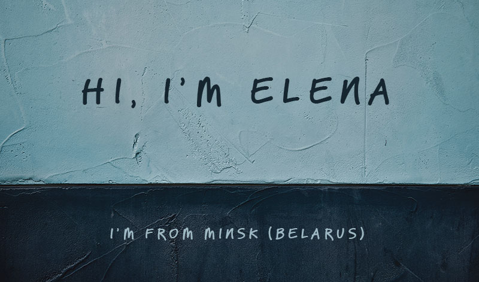

## Contacts
**E-mail:** elena.bo.d8@gmail.com  
**Skype:** elena.bo.d8  
## Languages and Tools
A basic level of

## Projects
* [Слайдер на CSS](https://el-mouse.github.io/cssMemSlider/cssMemSlider/index.html)
* [Pizza. Верстка лендинга без адаптива (HTML, CSS)](https://el-mouse.github.io/Pizza/)

<!---
el-mouse/el-mouse is a ✨ special ✨ repository because its `README.md` (this file) appears on your GitHub profile.
You can click the Preview link to take a look at your changes.
--->
